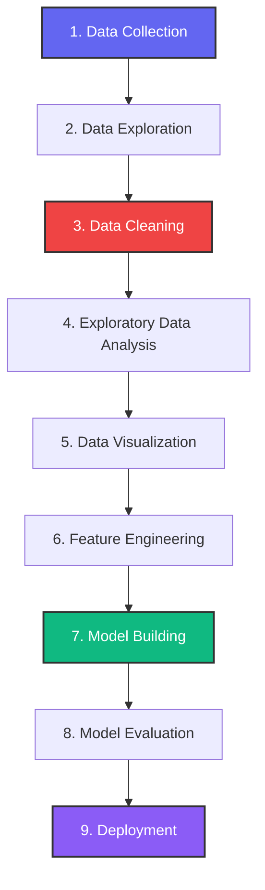

# Employee Retention Prediction using Logistic Regression

## 📌 Project Overview

This project predicts whether an employee will leave the company or stay using the **Logistic Regression** algorithm. The project includes data cleaning, exploratory data analysis (EDA), data visualization, feature engineering, model training, and performance evaluation.

---

## 📂 Dataset

- **Dataset:** HR Employee Retention Dataset
- **Source:** Kaggle
- **Format:** CSV (`HR_comma_sep.csv`)

---

## 🎯 Objective

The main objective of this project is to:
- Analyze factors affecting employee retention.
- Visualize the relationship between salary, department, and employee retention.
- Build a Logistic Regression model.
- Predict employee retention.
- Measure the model's accuracy.

---

## 🛠️ Technologies Used

- **Programming Language:** Python
- **Data Manipulation:** Pandas, NumPy
- **Visualizations:** Plotly, Matplotlib
- **Machine Learning:** Scikit-learn
- **Web Interface:** Streamlit (Custom Glassmorphism SaaS UI)

---

## 📚 Libraries Used

```python
import pandas as pd
import matplotlib.pyplot as plt
from sklearn.model_selection import train_test_split
from sklearn.linear_model import LogisticRegression
from sklearn.metrics import accuracy_score
```

---

## 🔄 Project Workflow

Here is the step-by-step visual workflow of the machine learning pipeline:



### 1. Data Collection
- Downloaded HR Employee Retention dataset from Kaggle.

### 2. Data Exploration
- Displayed first and last records.
- Checked dataset shape.
- Viewed column names.
- Inspected data types.
- Generated statistical summary.

### 3. Data Cleaning
- Checked missing values.
- Found duplicate records.
- Removed duplicate rows to prevent model bias.

### 4. Exploratory Data Analysis (EDA)
- Identified factors affecting employee retention.
- Used GroupBy analysis.
- Analyzed employee retention by salary.
- Analyzed employee retention by department.

### 5. Data Visualization
- Salary vs Employee Retention (Bar Chart).
- Department vs Employee Retention (Bar Chart).
- Core correlation heatmap and distributions.

### 6. Feature Engineering
- Selected important features.
- Converted categorical variables (`salary` and `Department`) into numerical values using One-Hot Encoding via a scikit-learn pipeline transformer.

### 7. Model Building
- Split the dataset into training and testing sets (80:20 split).
- Trained Logistic Regression model using regularized solver.

### 8. Model Evaluation
- Predicted employee retention.
- Calculated model accuracy.

---

## 📊 Features Used

- **Satisfaction Level** (Numeric score from 0.0 to 1.0)
- **Last Evaluation Score** (Numeric assessment score)
- **Number of Projects** (Count of key assignments)
- **Average Monthly Hours** (Working hours)
- **Time Spent in Company** (Tenure in years)
- **Work Accident** (Flag indicating incidents)
- **Promotion Last 5 Years** (Promotion flag)
- **Salary** (Encoded categories: low, medium, high)
- **Department** (Encoded divisions)

---

## 🤖 Machine Learning Algorithm

- **Logistic Regression** (Binary Classification)

---

## 📈 Model Accuracy

**Accuracy:** **86%**

The model correctly predicts employee retention for approximately **86 out of every 100 employees**.

---

## 📁 Project Structure

```text
Employee-Retention-Prediction/
│
├── app.py                            # Streamlit Web App (Premium SaaS Design)
├── model.pkl                         # Trained Logistic Regression Pipeline
├── HR_comma_sep.csv                  # Dataset CSV File
├── requirements.txt                  # Python Dependencies
├── style.css                         # Custom UI Stylesheet
├── README.md                         # Documentation
├── employee_retention_logistic_regression.py  # Original Analysis Script
│
├── assets/
│   └── style.css                     # Asset CSS Duplicate
└── images/
    └── dev_avatar.jpg                # Developer Profile Image
```

---

## 🚀 How to Run

1. **Clone the repository**
```bash
git clone https://github.com/yourusername/Employee-Retention-Prediction.git
cd Employee-Retention-Prediction
```

2. **Install required libraries**
```bash
pip install -r requirements.txt
```

3. **Run the Streamlit application**
```bash
streamlit run app.py
```

*To run the raw command-line analysis script directly:*
```bash
python employee_retention_logistic_regression.py
```

---

## 📌 Conclusion

The project demonstrates how machine learning can be used to predict employee retention. After performing data cleaning, exploratory data analysis, visualization, and feature engineering, a Logistic Regression model was trained and achieved an accuracy of **86%**, making it effective for predicting whether an employee is likely to stay or leave the company.

---

## 👨‍💻 Author

**Ankit Yadav**  
*B.Tech CSE Student*  
Shri Ramswaroop Memorial College of Engineering & Management (SRMCEM), Lucknow

**Interested in:**
- Data Analytics
- Machine Learning
- Artificial Intelligence
- Python Programming
